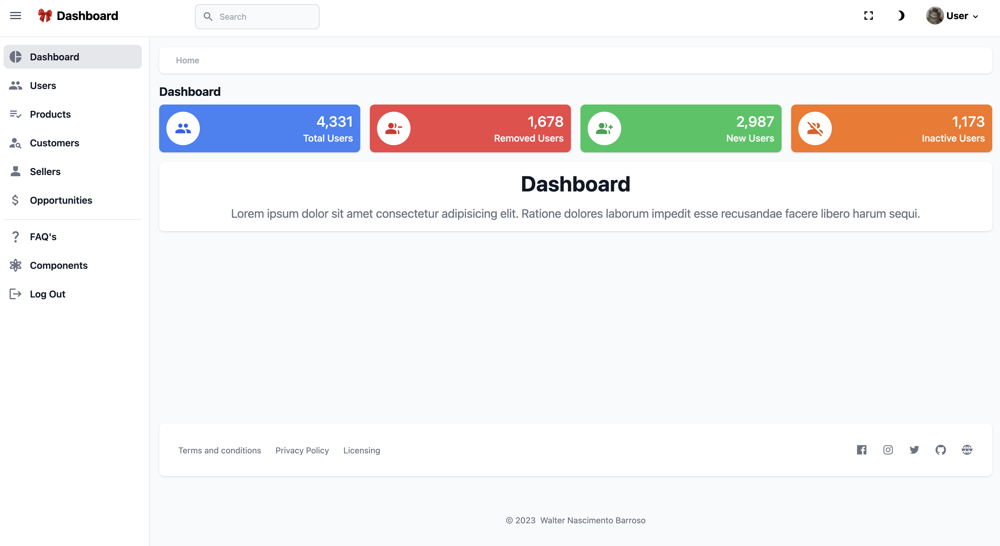

<div align="center">

# Title

[](https://www.loom.com/share/7a81df8041a545b9be0c3b054a1a6e32)

</div>

## :scroll: Overview

Project test

[https://www.loom.com/share/7a81df8041a545b9be0c3b054a1a6e32](https://www.loom.com/share/7a81df8041a545b9be0c3b054a1a6e32)

## :dvd: Backend

Manual installation and documentation find [here](api/README.md)

## :dvd: Frontend

Manual installation and documentation find [here](web/README.md)

## :floppy_disk: Installation

[Presentation](https://www.loom.com/share/7a81df8041a545b9be0c3b054a1a6e32)

```
git clone https://github.com/walternascimentobarroso/vitaminaWEB.git
```

## :memo: License

The [MIT License]() (MIT)

## :smiley_cat: Author

- [@walternascimentobarroso](https://walternascimentobarroso.github.io/)

Made with &nbsp;❤️&nbsp;
